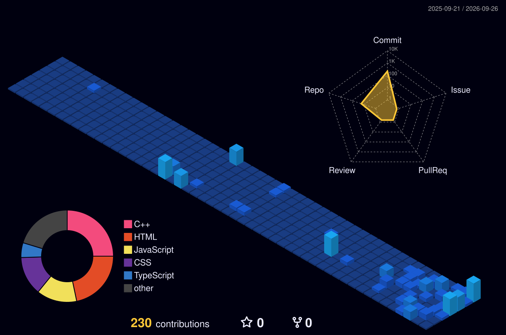

  

<h1>💫 About Me:</h1>

Hi, I'm Satyam Kumar 👋  🎓 B.Tech CSE Student  I'm a Computer Science student passionate about web development, problem-solving, and building practical projects.  🛠️ Tech Stack Languages: C++, JavaScript Frontend: HTML, CSS, React Tools: Git, GitHub, VS Code Currently Learning: Data Structures & Algorithms, Backend Development 🚀 What I'm Working On Strengthening my DSA and problem-solving skills Building projects with JavaScript & React Exploring full-stack web development Learning how to use AI effectively in software development

## 🌐 Socials:
   

# 💻 Tech Stack:
           
# 📊 GitHub Stats:
 
 

  

  

ppp
## 🏆 GitHub Trophies

### ✍️ Random Dev Quote

### 🔝 Top Contributed Repo

---

<!-- Proudly created with GPRM ( https://gprm.itsvg.in ) -->
